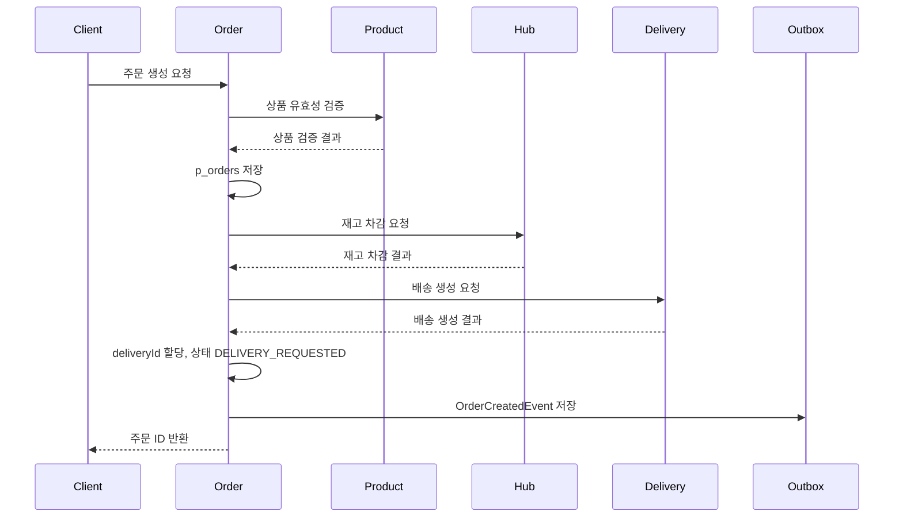
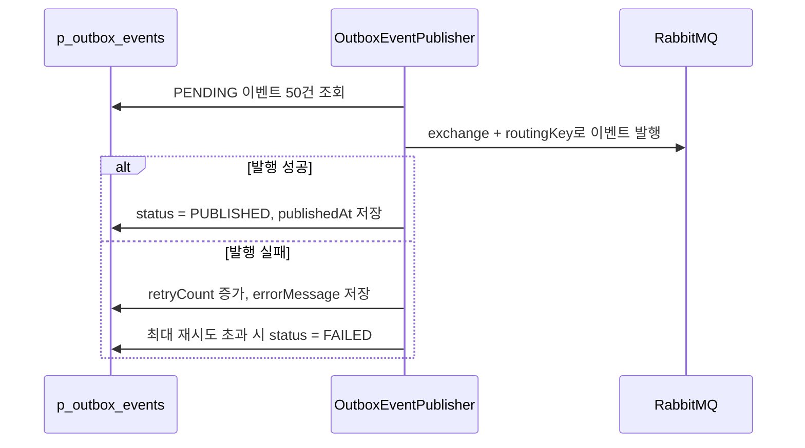

# Logistics Order Service

백마택배 물류 시스템의 주문 도메인 서비스입니다.

주문 생성/수정/취소/삭제/조회 기능을 담당하며, 상품/재고/배송 서비스와 연동해 주문 처리 흐름을 관리합니다. 추가로 Outbox 패턴과 RabbitMQ 기반 이벤트 발행 구조를 적용해 주문 이벤트 저장과 발행의 정합성을 보장합니다.

---

## 📁 프로젝트 패키지 구조

```text
├── application
│   ├── command       # 주문 생성/수정/취소/삭제/상태 변경, Outbox/Saga 서비스
│   └── query         # 주문 조회/검색/통계
├── domain
│   ├── entity        # Order, OutboxEvent
│   ├── model         # OrderStatus, OutboxStatus
│   └── repository    # OrderRepository, OutboxEventRepository
├── infrastructure
│   ├── feign         # Product/Hub/Delivery 서비스 연동
│   ├── messaging     # RabbitMQ 설정, 이벤트 payload, listener, envelope
│   └── persistence   # JPA 공통 엔티티
└── presentation
    ├── command       # 주문 Command API
    ├── query         # 주문 Query API
    └── common        # 공통 응답/예외/설정
```

---

## API

### Command

| Method | Path | 설명 |
| --- | --- | --- |
| `POST` | `/api/v1/orders` | 주문 생성 |
| `PATCH` | `/api/v1/orders/{orderId}` | 주문 수정 |
| `PATCH` | `/api/v1/orders/{orderId}/cancel` | 주문 취소 |
| `DELETE` | `/api/v1/orders/{orderId}` | 주문 논리 삭제 |
| `PATCH` | `/api/v1/orders/{orderId}/status` | 주문 상태 변경 |

### Query

| Method | Path | 설명 |
| --- | --- | --- |
| `GET` | `/api/v1/orders/{orderId}` | 주문 단건 조회 |
| `GET` | `/api/v1/orders` | 주문 목록 검색 |
| `GET` | `/api/v1/orders/stats` | 주문 통계 조회 |

### 검색 조건

`GET /api/v1/orders`, `GET /api/v1/orders/stats`에서 사용할 수 있는 조건입니다.

| Parameter | Type | 설명 |
| --- | --- | --- |
| `receiverCompanyId` | UUID | 수령 업체 ID |
| `productId` | UUID | 상품 ID |
| `deliveryId` | UUID | 배송 ID |
| `status` | OrderStatus | 주문 상태 |
| `startDate` | Instant | 검색 시작 일시 |
| `endDate` | Instant | 검색 종료 일시 |

---

## 주문 상태

상태 전이는 아래 순서를 기준으로 제한합니다.

```text
PENDING -> DELIVERY_REQUESTED -> DELIVERING -> COMPLETED
```

`CANCELED`, `FAILED`, `COMPLETED` 상태는 종료 상태로 보고 이후 상태 변경을 제한합니다.

---

## 서비스 연동

Order 서비스는 OpenFeign을 통해 다른 서비스와 연동합니다.

| Client | 대상 서비스 | 용도 |
| --- | --- | --- |
| `ProductClient` | `company-product-service` | 상품 유효성 검증 |
| `HubClient` | `hub-service` | 재고 차감/복구 |
| `DeliveryClient` | `delivery-service` | 배송 생성/취소/상태 조회 |

---

## 주문 생성 흐름

현재 주문 생성은 동기 Feign 연동을 기반으로 처리합니다.



배송 생성 실패 시에는 재고 복구를 요청하고 주문 상태를 `FAILED`로 변경합니다.

---

## Outbox 테이블을 별도로 둔 이유

처음에는 주문 생성이 완료되는 시점에 바로 RabbitMQ로 이벤트를 발행하는 방식도 고려했습니다. 하지만 주문 저장은 성공했는데 이벤트 발행이 실패하거나, 반대로 이벤트는 발행됐는데 주문 트랜잭션이 롤백되는 상황이 생기면 서비스 간 데이터 정합성이 깨질 수 있습니다.

그래서 주문 데이터와 이벤트 데이터를 같은 DB 트랜잭션 안에서 저장하기 위해 `p_outbox_events` 테이블을 별도로 두었습니다.

```text
p_orders 저장
p_outbox_events 저장
```

위 두 작업이 같은 트랜잭션으로 묶이면 주문이 저장된 경우에만 이벤트도 저장되고, 주문 저장이 실패하면 이벤트도 같이 저장되지 않습니다. RabbitMQ 발행은 이후 스케줄러가 처리하므로, 일시적인 메시지 브로커 장애가 주문 생성 트랜잭션을 직접 깨지 않도록 분리할 수 있습니다.

---

## Outbox 패턴

Outbox 패턴은 비즈니스 데이터 저장과 이벤트 발행 사이의 정합성을 맞추기 위한 구조입니다.

주문 생성/취소/완료 시 RabbitMQ로 바로 이벤트를 발행하지 않고, 먼저 같은 트랜잭션 안에서 `p_outbox_events` 테이블에 이벤트를 저장합니다. 이후 스케줄러가 `PENDING` 상태의 이벤트를 조회해 RabbitMQ로 발행합니다.

### Outbox 저장 대상 이벤트

| 이벤트 | Routing Key | 발생 시점 |
| --- | --- | --- |
| `OrderCreatedEvent` | `order.created` | 주문 생성 성공 |
| `OrderCanceledEvent` | `order.canceled` | 주문 취소 성공 |
| `OrderCompletedEvent` | `order.completed` | 주문 완료 상태 변경 |

### p_outbox_events

| 컬럼 | 설명 |
| --- | --- |
| `aggregate_type` | 이벤트 대상 도메인 타입 |
| `aggregate_id` | 이벤트 대상 도메인 ID |
| `event_type` | 이벤트 타입 |
| `exchange` | RabbitMQ exchange |
| `routing_key` | RabbitMQ routing key |
| `payload` | EventEnvelope JSON |
| `status` | `PENDING`, `PUBLISHED`, `FAILED` |
| `retry_count` | 발행 재시도 횟수 |
| `error_message` | 마지막 발행 실패 메시지 |
| `published_at` | 발행 완료 일시 |

### 이벤트 Envelope

```json
{
  "header": {
    "messageId": "uuid",
    "actorId": "user-uuid",
    "eventType": "OrderCreatedEvent",
    "timestamp": "2026-08-12T00:00:00Z",
    "version": "v1"
  },
  "payload": {
    "id": "order-uuid",
    "receiverCompanyId": "company-uuid",
    "productId": "product-uuid",
    "quantity": 10,
    "orderStatus": "DELIVERY_REQUESTED"
  }
}
```

---

## Outbox 발행 흐름



발행 주기는 설정으로 관리합니다.

```yaml
message:
  outbox:
    publish-delay-ms: 5000
```

---

## RabbitMQ 설정

### Exchange

```text
baekma.exchange
```

### Queue

```yaml
message:
  queue:
    order: order.queue
    delivery: delivery.queue
    hub: hub.queue
    notification: notification.queue
    company: company.queue
```

### Routing Key

Order 서비스가 발행하는 이벤트입니다.

```yaml
message:
  binding-key:
    notification:
      order-created: order.created
      order-canceled: order.canceled
      order-completed: order.completed
```

Order 서비스가 Saga 결과로 수신하는 이벤트입니다.

```yaml
message:
  binding-key:
    order:
      inventory-deducted: hub.inventory.deducted
      inventory-deduct-failed: hub.inventory.deduct.failed
      inventory-restored: hub.inventory.restored
      inventory-restore-failed: hub.inventory.restore.failed
      delivery-created: delivery.created
      delivery-create-failed: delivery.create.failed
      delivery-canceled: delivery.canceled
      delivery-cancel-failed: delivery.cancel.failed
```

---

## Saga 결과 이벤트 처리

Order 서비스는 `order.queue`를 구독해 Hub/Delivery 서비스의 처리 결과 이벤트를 수신합니다.

| 수신 이벤트 | 처리 |
| --- | --- |
| `InventoryDeductedEvent` | 재고 차감 성공 로그 처리 |
| `InventoryDeductFailedEvent` | 주문 실패 처리 |
| `InventoryRestoredEvent` | 재고 복구 성공 로그 처리 |
| `InventoryRestoreFailedEvent` | 주문 실패 처리 |
| `DeliveryCreatedEvent` | `deliveryId` 할당 및 배송 요청 상태 변경 |
| `DeliveryCreateFailedEvent` | 주문 실패 처리 |
| `DeliveryCanceledEvent` | 배송 취소 성공 로그 처리 |
| `DeliveryCancelFailedEvent` | 주문 실패 처리 |

현재 주문 생성/취소 기본 흐름은 동기 Feign 방식으로 처리하고 있으며, Saga Listener는 메시징 전환 및 보상 흐름 확장을 위한 구조로 추가되어 있습니다.

---
